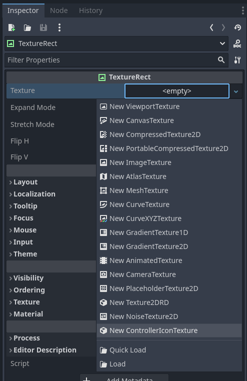
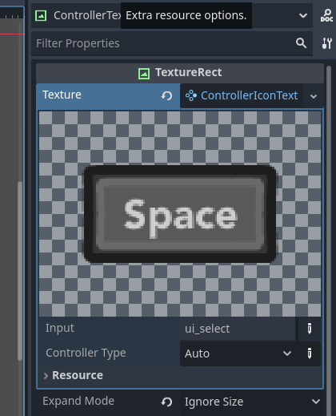
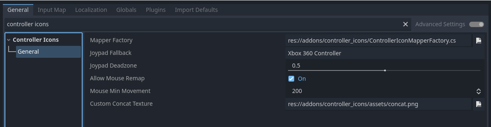

# Controller Icons - Documentation

## Contents

- [Quick-start guide](#quick-start-guide)
	- [Input action](#input-action)
	- [Generic joypad path](#generic-joypad-path)
	- [Specific path](#specific-path)
- [Reacting to input change](#reacting-to-input-change)
- [Settings](#settings)
- [Adding/removing controller iconss](#addingremoving-controller-icons)
- [Changing controller mapper](#changing-controller-mapper)
- [TTS support](#tts-support)
- [Porting addon versions](#porting-addon-versions)
	- [v2.x.x to v3.0.0](#v2xx-to-v300)
	- [v1.x.x to v2.0.0](#v1xx-to-v200)


# Quick-start guide

Controller Icons provides a new Texture2D resource, `ControllerIconTexture`, which displays the correct icon for the current input device. This can be used in any node that accepts a Texture2D, such as `TextureRect`, `Button`, `Sprite2D/3D`, `RichTextLabel`, etc...

> [!TIP]
> The `demo` folder contains some scenes showcasing and explaining how to use the addon as well.



The following properties are available:
- `Input`: Select an Action or InputEvent
- `Controller Type`: Select `Auto`to atuo detect the controller, or force the icon to a specific controller



The `Input` is the most relevant property, as it specifies what icons to show.

# Reacting to input change

The `ControllerIcons` singleton has an `input_type_changed` signal available so you can detect when the type of input device changes:

```cs
void my_func() {
	...
	ControllerIcons.InputTypeChanged += OnInputTypeChanged;
}

void OnInputTypeChanged(ControllerIconMapper mapper) {
	if (mapper is ControllerIconMapperPS5) {
		...
	}
}
```

# Settings

You can tweak the addon's behavior through the `Project` > `Project Settings ...` menu in the `Controller Icons` section.



- **General**
	- `Mapper Factory`: Custom Mapper script class that creates mappers for each controller configuration. For details check the code in [ControllerIconMapperFactory](addons/controller_icons/ControllerIconMapperFactory.cs).
	- `Joypad Fallback`: To what default controller type fallback to if automatic controller type detection fails.
	- `Joypad Deadzone`: Controller's deadzone for analogue inputs when detecting input device changes.
	- `Allow Mouse Remap`: If set, consider mouse movement when detecting input device changes.
	- `Mouse Min Movement`: Minimum "instantaneous" mouse speed in pixels to be considered for an input device change
	- `Custom Concat Texture`: Texture used to merge inputs Actions with multiple keys.

# Adding/removing controller icons

To remove controller icons you don't want to use, delete those files/folders from `res://addons/controller_icons/assets`. You might need to create a custom mapper in order to prevent the addon from trying to use deleted icons. For more information, refer to [Changing controller mapper](#changing-controller-mapper).

To add or change controller icons, while you can do it directly in the `assets` folder, you can intead set a custom Mapper factory folder for different assets and controllers.

# Changing controller mapper

The default mapper script maps generic joypad paths to a lot of popular controllers available. However, you may need to override how this mapping process works.

You can do so by creating a script which extends `ControllerIconMapperFactory`. Check the code in [ControllerIconMapperFactory](addons/controller_icons/ControllerIconMapperFactory.cs)

When receiving an empty string as device name, the factory must return a fallback Mapper that supports all inputs types.

# TTS support

~~Text-to-speech (TTS) is supported by the addon. To fetch a TTS representation of a given icon, you can call the texture's `get_tts_string()` method:~~

```gdscript
var tts_text = texture.get_tts_string()
```

~~This TTS text takes into consideration the currently displayed icon, and will thus be different if the icon is from keyboard/mouse or controller. It also takes into consideration the controller type, and will thus use native button names (e.g. `A` for Xbox, `Cross` for PlayStation, etc).~~

~~You can also request to convert an icon path directly throuh the `ControllerIcons` singleton:~~

```gdscript
func _ready():
	# Input Action - Will switch based on active keyboard/mouse or controller
	var tts_text = ControllerIcons.parse_path_to_tts("attack")

	# Generic Joypad Path - Will switch based on active controller
	var tts_text = ControllerIcons.parse_path_to_tts("joypad/a")

	# Specific Path
	var tts_text = ControllerIcons.parse_path_to_tts("xbox360/a")
	var ttx_text = ControllerIcons.parse_path_to_tts("key/z")
```
